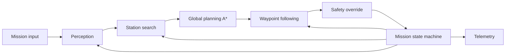

# System Architecture

Per issue [26](.github/issues/26-architecture-and-component-contracts.md). Draw this **before** writing any group code.

## One-page module diagram

Replace this with the actual figure (image, or a mermaid diagram rendered in whatever viewer the group uses).
Every module must have at least one arrow in and one arrow out — no orphan boxes.

Fill in / correct every arrow and box to match what the group actually agrees on. Nothing above is final.

## State machine

Name the states and transitions here first; issue [16](.github/issues/16-mission-state-machine.md) implements them, it does not invent them.

This table was still blank when Issue #16 started (no prior team session had filled it in), so it
was written as part of implementing #16, per that issue's own instruction: "if implementation forces
a different set, update that document in the same pull request so the diagram stays true."

| State | Purpose | Transitions out |
|---|---|---|
| PLAN | Pick the next unvisited station by A* path cost (`next_station`, Issue #15) | -> NAVIGATE (a station was chosen); -> FAILED (no unvisited stations left) |
| NAVIGATE | Drive to the chosen station's `observe` position with safety override active (`Navigator`, Issue #14) | -> OBSERVE (arrived, `Navigator.done()`); -> PLAN (failed to arrive within the step budget -- station marked visited and skipped, component-failure path) |
| OBSERVE | Stop and hold position for a short settle period so the camera isn't capturing mid-motion | -> IDENTIFY (settled) |
| IDENTIFY | Capture consecutive frames and run `identify()` (Issue #8) on each; require `IDENTIFY_CONSENSUS_FRAMES` consecutive frames agreeing on the same non-`NO_MATCH` label before accepting it | -> GOTO_OBSERVE (consensus reached and the agreed label is the mission target); -> PLAN (consensus reached on a non-target label, or `IDENTIFY_MAX_FRAMES` reached with no consensus -- station marked visited either way, both are defined "component gave an unusable answer" paths) |
| GOTO_OBSERVE | One final precise approach to the confirmed station's exact `observe` position (`Navigator` again, idempotent if already there) | -> STOP (arrived, or the step budget elapsed -- stops where it is rather than looping forever) |
| STOP | Halt: `stop()` (Issue #3), motors at zero | terminal |
| FAILED | Halt: `stop()` (Issue #3), motors at zero, mission unsuccessful | terminal |

Every non-terminal state has a defined response to its component returning nothing or failing
outright (see `docs/interfaces.md`'s per-module "Failure behaviour" rows): `NAVIGATE` and
`GOTO_OBSERVE` both cap the number of control steps they will spend trying, `IDENTIFY` caps the
number of frames it will examine before giving up on a station, and no failure path re-enters a
state that could loop forever without making progress (every failure marks the current station
visited and returns to `PLAN`, which always terminates because `unvisited` only shrinks).

## Approval

- [ ] Member A approved on: ____
- [ ] Member B approved on: ____
- [ ] Member C approved on: ____

Record each approval as a row in `docs/contribution_log.md` too.
