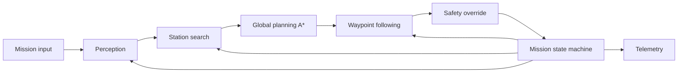

# System Architecture

Per issue [26](.github/issues/26-architecture-and-component-contracts.md). Draw this **before** writing any group code.

## One-page module diagram

Replace this with the actual figure (image, or a mermaid diagram rendered in whatever viewer the group uses).
Every module must have at least one arrow in and one arrow out — no orphan boxes.

Fill in / correct every arrow and box to match what the group actually agrees on. Nothing above is final.

## State machine

Name the states and transitions here first; issue [16](.github/issues/16-mission-state-machine.md) implements them, it does not invent them.

| State | Purpose | Transitions out |
|---|---|---|
| PLAN | | |
| NAVIGATE | | |
| OBSERVE | | |
| IDENTIFY | | |
| GOTO_OBSERVE | | |
| STOP | | |
| FAILED | | |

## Approval

- [ ] Member A approved on: ____
- [ ] Member B approved on: ____
- [ ] Member C approved on: ____

Record each approval as a row in `docs/contribution_log.md` too.
