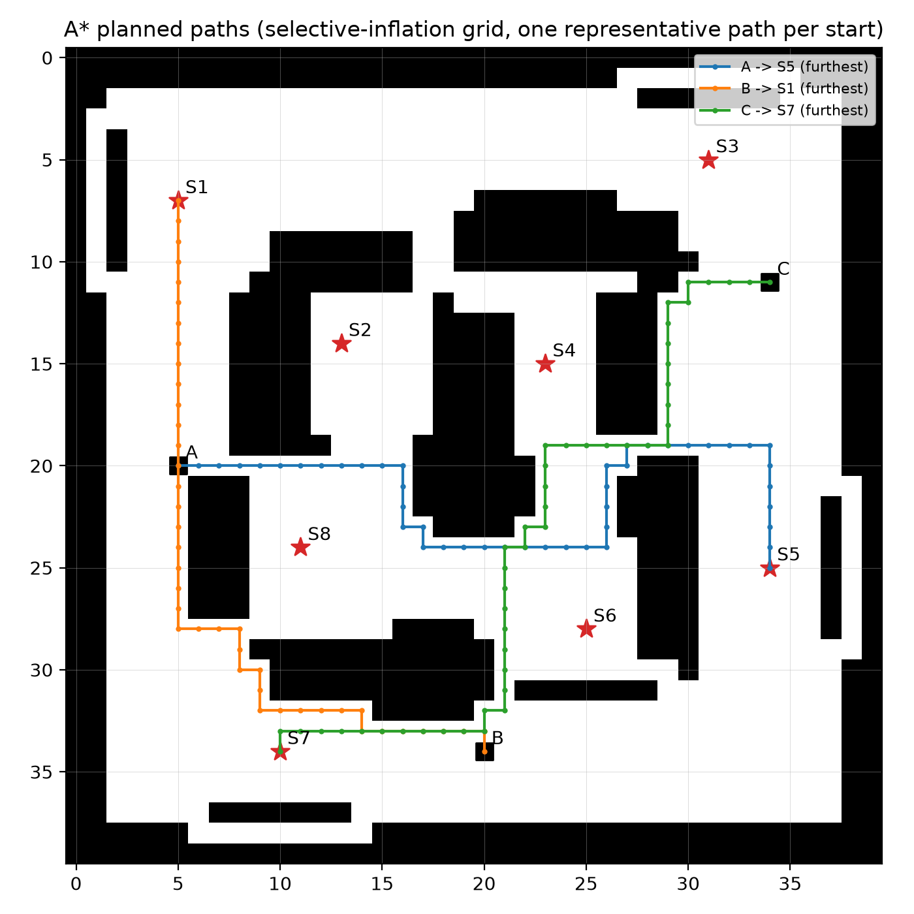

# A* Path Planning

Per [Issue #12](.github/issues/12-implement-astar.md). Generated by `python tools/check_astar.py`.

`astar(grid, start, goal)` in `project_utils.py`, adapted from the Workshop 8 Part 6 starter
(`heapq` open set, 4-connected expansion, Manhattan heuristic, g-cost/parent tracking, path
reconstruction). Plans on the grid from the Issue #11 clearance policy
(`selective` inflation, radius 4), not the raw grid.

## Results across all 24 start/station pairs

| Start | Station | Path length (cells) | Planning time (ms) | Valid |
|---|---|---:|---:|---|
| A | S1 | 14 | 0.032 | True |
| A | S2 | 15 | 0.044 | True |
| A | S3 | 42 | 0.070 | True |
| A | S4 | 32 | 0.219 | True |
| A | S5 | 45 | 0.375 | True |
| A | S6 | 29 | 0.160 | True |
| A | S7 | 20 | 0.083 | True |
| A | S8 | 11 | 0.029 | True |
| B | S1 | 43 | 0.071 | True |
| B | S2 | 30 | 0.079 | True |
| B | S3 | 41 | 0.099 | True |
| B | S4 | 23 | 0.033 | True |
| B | S5 | 24 | 0.100 | True |
| B | S6 | 12 | 0.016 | True |
| B | S7 | 11 | 0.017 | True |
| B | S8 | 22 | 0.065 | True |
| C | S1 | 36 | 0.086 | True |
| C | S2 | 35 | 0.189 | True |
| C | S3 | 10 | 0.015 | True |
| C | S4 | 24 | 0.129 | True |
| C | S5 | 15 | 0.024 | True |
| C | S6 | 27 | 0.134 | True |
| C | S7 | 48 | 0.345 | True |
| C | S8 | 37 | 0.133 | True |

- All 24 paths valid (correct endpoints, no obstacle cells, 4-connected steps): **True**
- Slowest single-path planning time: **0.375 ms** (budget: under 1000 ms)
- Empty-goal edge cases (obstacle goal, enclosed goal) return `[]` without raising: **True**

## Figure

One representative path per start is drawn (all 24 are computed and checked above; plotting all 24
would be unreadable in one figure).
