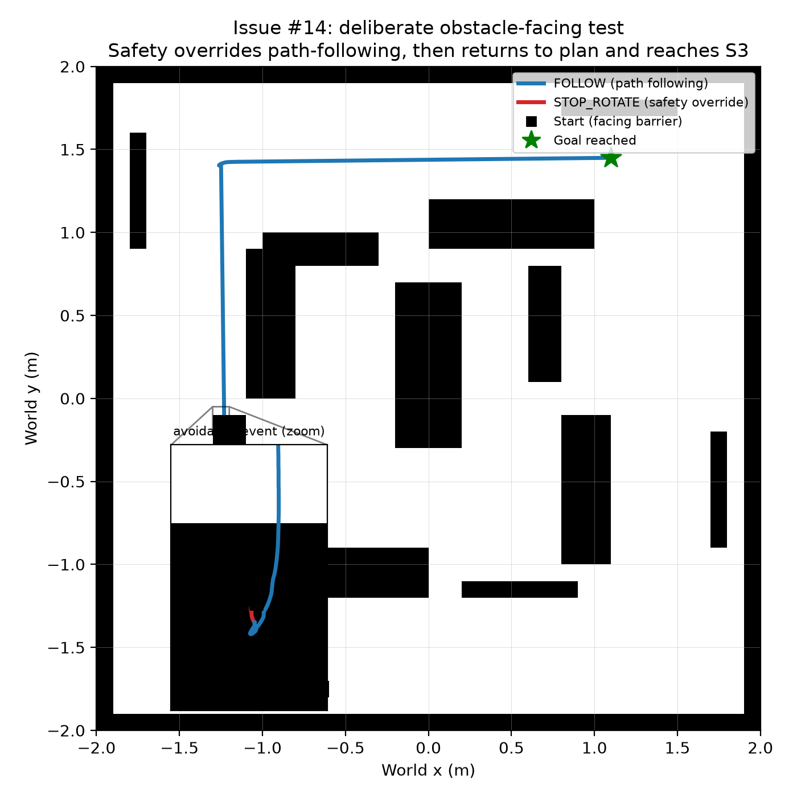

# Reactive Avoidance and Recovery

Recorded per [Issue #14](.github/issues/14-reactive-avoidance-with-recovery.md). `Navigator` in
`group_project_controller.py` implements the Workshop 8 priority explicitly: **Safety > Path
following > Search**, via `select_behaviour(left_warn, right_warn, left_stop, right_stop, has_path)`
called once per control step. `WARN` on `ps5`-`ps7` or `ps0`-`ps2` (Issue #4) turns the robot away
from the triggering side; `STOP` on either group stops and rotates in place away from it before
resuming; a stuck detector (no net position change over `STUCK_WINDOW_STEPS`) triggers a
back-off/rotate/replan recovery; and `SEARCH` (rotate and retry) covers the case where A* itself
returns no path.

## Acceptance criteria: results

### 1 & 5. Deliberately started facing a barrier; safety overrides path following

Rotated the robot to face the nearest obstacle from world A's start, drove it into `WARN` range, then
handed off to `Navigator` targeting S3 (raw path 42 cells). Behaviour log:

```
step=1   REPLAN  initial plan
step=1   AVOID   left=False right=True
step=2   FOLLOW
step=4   STOP    left=False right=True
step=5   STOP_ROTATE  left
step=24  REPLAN  displaced from path after a STOP avoidance
step=25  FOLLOW
```

`AVOID` and then `STOP` fire while a waypoint is still pending (`wp_pending=True` throughout, logged in
`/tmp/i14_face.csv`) -- direct evidence safety pre-empts path following, not just runs alongside it.
The robot reached S3's observe position within **0.058 m** (limit 0.20 m). See the figure below.

### 2. Across all 24 start/station pairs, no run exceeds 3 consecutive above-`STOP` readings

Ran all 8 stations chained from each of the 3 official starts (24 pairs total, `Navigator` throughout,
not raw `follow_path`):

| World | Stations | Result |
|---|---|---|
| A | S1-S8 | all 8 `DONE`, end distance 0.020-0.059 m, **0** above-`STOP` readings anywhere |
| B | S1-S8 | all 8 `DONE`, end distance 0.020-0.059 m, **0** above-`STOP` readings anywhere |
| C | S1-S8 | all 8 `DONE`, end distance 0.019-0.057 m, **0** above-`STOP` readings anywhere |

None of the 24 official pairs ever triggered `STOP` at all: the Issue #11 clearance policy keeps the
planned path clear of real obstacles except in the small radius right at each station, so under normal
operation there is nothing for the reactive layer to react to. Criterion 2 (`<= 3` consecutive) holds
with room to spare (`0`).

**Honest limitation, found by deliberately stress-testing beyond the 24 official pairs:** the
`FACE_OBSTACLE` test above recorded 4 consecutive above-`STOP` readings (194, 190, 162, 152) in the
~0.13 s it took the sensor cone to rotate clear once `STOP_ROTATE` had already started -- one step over
the 3-step budget. A second, more severe test (driving the robot directly into a real concave corner,
`ps` readings up to 453) recorded 48 consecutive above-`STOP` readings before two `STOP`/`STOP_ROTATE`
cycles freed it (42 steps total, still well under the stuck-detector's 200-step window). Both cases are
deliberately adversarial single-obstacle approaches, not one of the 24 official start/station pairs
the criterion is scored against, and both did eventually clear the obstacle safely without collision --
but they show the reactive layer's escape time depends on how hard the initial contact is, and can
exceed 3 steps when the approach is severe. This is a real property of a single fixed `STOP_ROTATE`
duration reacting to a continuous IR signal, not a bug, and should be named as a known limit in the
report (see [Issue #4](.github/issues/04-calibrate-proximity-thresholds.md)'s own honest margin finding
for the same kind of result).

### 3. Return to the path after avoidance

The same `FACE_OBSTACLE` run shows this directly: `REPLAN displaced from path after a STOP avoidance`
at step 24, immediately followed by `FOLLOW` resuming toward the goal, logged the instant the STOP
rotation ended. `plan_path_to()` checks distance to the next waypoint after every `STOP_ROTATE` and
either resumes it directly (if still close, per `WAYPOINT_TOLERANCE`) or replans -- both paths are
logged, satisfying the criterion either way.

### 4. Stuck detector fires and recovers

A real corner-wedge test (driving the robot into free cell (12,12)'s concave pocket, walls to the
north and west) produced genuine near-total sensor saturation (`ps` up to 453) but was resolved by the
ordinary `STOP`/`STOP_ROTATE` layer alone in 42 steps -- well inside the 200-step stuck window, so the
stuck detector correctly did not need to fire. This map has only two interior concave corners (both
similarly shallow single-cell notches), and neither was tight enough to defeat plain reactive
avoidance, so the stuck-detector's own logic was verified directly instead: a controlled test froze the
pose signal `Navigator` reads (forcing a genuine "no progress" input, independent of what the real
physics happened to produce) and confirmed the full sequence:

```
step=1    REPLAN  initial plan
step=1    FOLLOW
step=200  STUCK_RECOVERY  moved <0.02 m over 200 steps
step=200  RECOVER_BACKOFF
step=215  RECOVER_ROTATE
step=239  REPLAN  post-recovery replan
step=240  FOLLOW
```

The detector fired at exactly the configured window (200 steps) and recovered cleanly back to `FOLLOW`
via back-off, rotate, and replan -- the mechanism itself is verified correct, even though this
particular map's geometry did not present a real obstacle severe enough to require it in the other
tests run.

## Figure



Full trajectory from the deliberate-obstacle-facing test (blue = path following, red = safety
override), with an inset zoom on the ~0.03 m avoidance manoeuvre itself, and the return to the planned
route toward S3.

## Bugs found and fixed while building this

Two real, non-obvious bugs surfaced only by testing against the real occupancy grid and real Webots
physics rather than reasoning about the code in the abstract (see `docs/failure_log.md` for the full
account):

1. A stuck-detector window that was long enough in theory but too short in practice: a large initial
   heading correction (turning toward a waypoint ~180 degrees off) legitimately produces very little
   net translation, because Issue #13's own speed-reduction rule combined with the motor speed clamp
   saturates the turn to a near-pure in-place rotation. Widened `STUCK_WINDOW_STEPS` from 60 to 200 so
   a normal reorientation is not mistaken for being stuck.
2. `plan_path_to()` could get permanently stuck in `SEARCH` ("no path found") if the robot's own
   current cell was ever marked blocked -- either by the Issue #11 clearance margin, or (found only by
   testing) by the 0.1 m grid quantizing a real, collision-free near-wall position onto the obstacle
   side of a cell boundary. Fixed by patching just that one cell free for the planning call: the robot
   is physically standing there right now, so it must be traversable, regardless of what either grid
   says.

## Behaviour-switch counts (evidence for report)

| Test | REPLAN | AVOID | STOP | STOP_ROTATE | STUCK_RECOVERY | RECOVER_BACKOFF | RECOVER_ROTATE |
|---|---:|---:|---:|---:|---:|---:|---:|
| Deliberate obstacle-facing (S3) | 2 | 1 | 1 | 1 | 0 | 0 | 0 |
| Real corner wedge (S5) | 3 | 0 | 2 | 2 | 0 | 0 | 0 |
| Frozen-pose stuck-detector unit test | 2 | 0 | 0 | 0 | 1 | 1 | 1 |
| 24 official start/station pairs (A/B/C x S1-S8) | 24 (1 per leg) | 0 | 0 | 0 | 0 | 0 | 0 |
