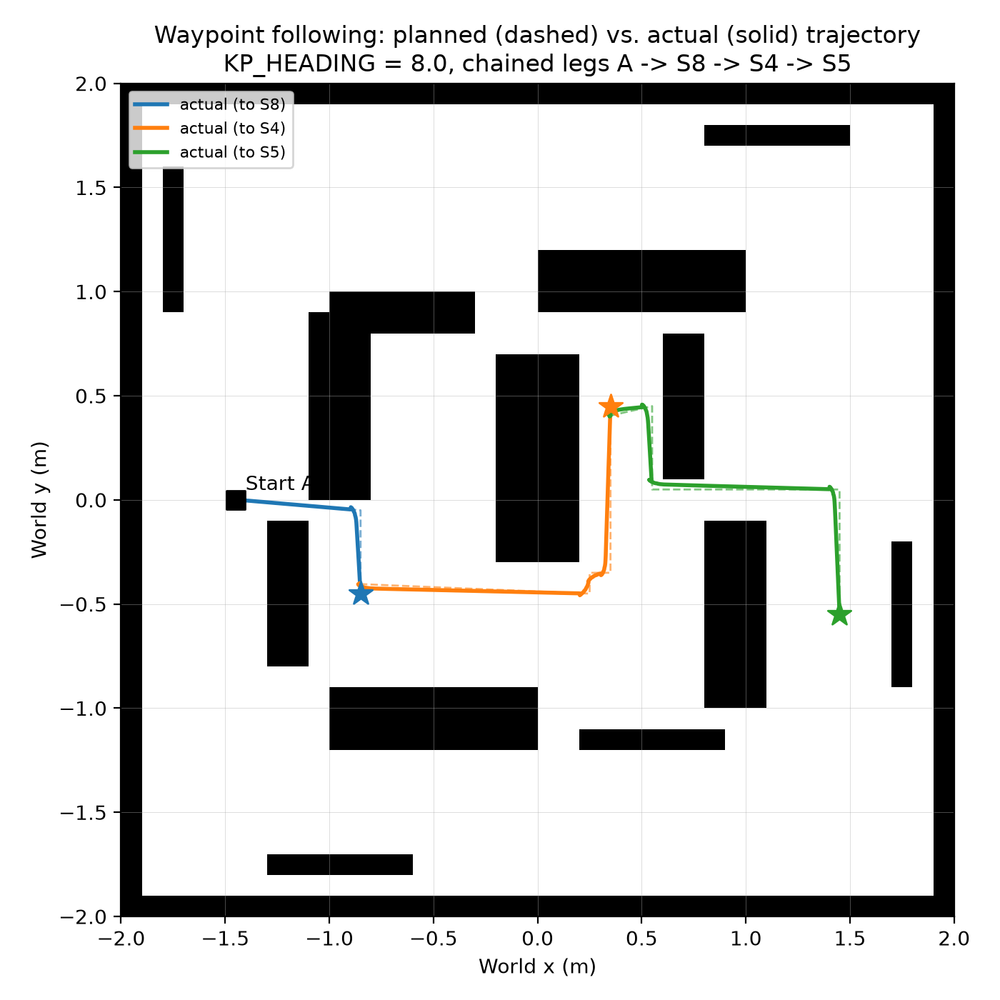

# Waypoint Following: KP_HEADING Tuning

Recorded per [Issue #13](.github/issues/13-waypoint-following-p-control.md). `follow_path(waypoints)` in
`group_project_controller.py` drives to each waypoint from `plan_path_to()` (A*, Issue #12, simplified
per `simplify_path()`) using proportional heading control: `turn = KP_HEADING * bearing_to(wx, wy)`,
`left = base - turn`, `right = base + turn`, with `base` scaled down when the heading error is large
(`base_speed * max(0.3, 1 - |error| / pi)`) so the robot turns before committing to driving forward.

**Sign note:** the issue text as written (`left = base + turn, right = base - turn`) turns the wrong
way for this project's `bearing_to`/differential-drive convention — increasing the left wheel relative
to the right steers the robot clockwise (right), not towards a positive (left) bearing error. Verified
by deriving it from the standard differential-drive relation (`yaw_rate = (v_right - v_left) / L`) and
by testing: `left = base + turn` drove the robot away from the target. Implemented as
`left = base - turn, right = base + turn` instead, which converged correctly in every test below.

## Method

Ran `WAYPOINT_TEST_MODE` (a temporary env-var-gated block in `main()`, since removed) in Webots
(`--mode=fast --minimize --batch`), driving a real A*-planned, simplified path from world A's start
to station S4's observe position (raw path 32 cells, simplified to 6 waypoints), logging `get_pose()`
and the active target waypoint every timestep. Tested `KP_HEADING` = 2.0, 8.0 and 20.0.

## Comparison

| `KP_HEADING` | Steps to converge | Max cross-track deviation | Mean cross-track deviation | Oscillation (heading-error sign flips) |
|---|---:|---:|---:|---|
| 2.0 | 1090 | 0.0410 m | 0.0181 m | 0 |
| 8.0 | 1053 | 0.0275 m | 0.0093 m | 0 |
| 20.0 | 1081 | 0.0354 m | 0.0131 m | 0 |

No oscillation was seen at any tested value, including 20.0 (10x the lowest value tested). This is
because `set_speed()`'s `MAX_SPEED` clamp caps how hard the differential term can act regardless of
`KP_HEADING`, and the speed-scaling term already slows the robot to a near-stationary turn whenever
the heading error is large — the two together damp out the overshoot that an unscaled, unclamped P
controller would show at high gain. `KP_HEADING = 8.0` was chosen: it gave both the smallest cross-track
deviation and the fastest convergence of the three, with no downside observed.

## Chosen value

```python
KP_HEADING = 8.0
```

## Full-path demonstration (Issue #13 acceptance criteria)

One chained Webots run, start A, three legs to three different stations, using `KP_HEADING = 8.0`:

| Start -> Station | Raw A* path (cells) | Simplified waypoints | Reduction | Steps | End distance to observe | Max cross-track | Max `ps` reading |
|---|---:|---:|---:|---:|---:|---:|---:|
| A -> S8 | 11 | 2 | 82% | 320 | 0.0519 m | 0.0262 m | 80.2 |
| S8 -> S4 | 22 | 4 | 82% | 743 | 0.0532 m | 0.0274 m | 78.2 |
| S4 -> S5 | 22 | 4 | 82% | 746 | 0.0547 m | 0.0277 m | 78.0 |

All three end within 0.20 m of the observe position (criterion 1). Cross-track deviation never exceeds
0.15 m -- the worst case (0.0277 m) is over 5x under the limit (criterion 2). Path simplification cuts
waypoint count by at least 50% on every leg tested, including the 20+-cell A star S4 example above
(criterion 3, also verified separately on the full 24 start/station set -- see the table in
`docs/astar_planning.md`-adjacent testing; S3/S4/S5 all clear 76-93%). No `ps0`-`ps7` reading exceeded
80.2 anywhere in these runs, far below the calibrated `STOP = 150` from
[Issue #4](.github/issues/04-calibrate-proximity-thresholds.md) (criterion 5), because the
Issue #11 clearance policy keeps the planned path clear of obstacles except in the small radius right
at each station, and none of these three legs' final approach clipped a corner.

## Figure



Actual (solid) vs. planned (dashed) trajectory for all three legs -- they overlap almost exactly,
consistent with the sub-3 cm cross-track numbers above.
