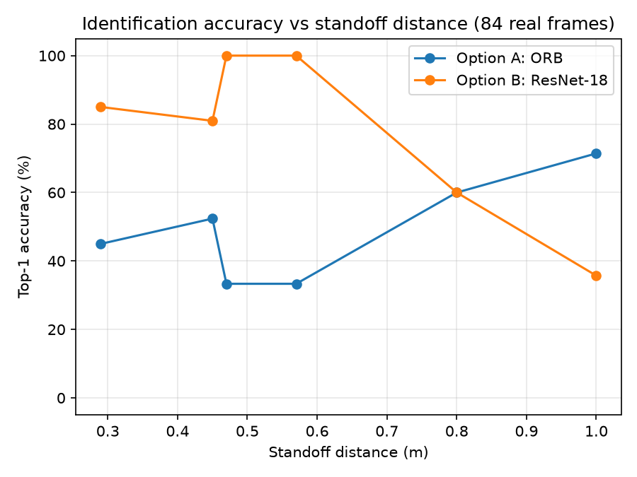

# Vision Identification Approach: ORB vs ResNet-18

Recorded per [Issue #6](.github/issues/06-choose-identification-approach.md).

## Why not the Workshop 8 Part 3 red-mask threshold

The workshop is explicit that the Part 3 red-mask method is not sufficient for this
project. Tested directly on real captures rather than just asserted: the same HSV red
threshold from the workshop (`H in [0,10] or [170,180], S>70, V>50`) fires on the
**floor far more than the poster**, and finds nothing at all on 7 of the 8 targets
(only `soda_can` is red).

- `soda_can` (the one red target) at 0.8 m: 365 red pixels in the poster
  region vs 2930 on the floor -- more than half the "detections" are the floor,
  not the poster.
- `headphones` (a non-red target) at the same distance: 17 pixels in the
  poster region -- the threshold does not fire on the target at all.

See `docs/data/red_mask_inadequate.png` (left: raw frame, right: red-mask overlay, one red
target and one non-red target at the same distance). A single colour threshold cannot tell
*which* of eight named targets is showing -- it can only ever answer a yes/no "is there
red" question, and even that answer is dominated by the floor here.

## Method

Both options were tuned/trained **only** on the 8 reference images in `textures/target_*.png`.
Scored on 76 of 84 real captured frames from all three training worlds and all 8
stations (`docs/data/vision_eval_captures/`, produced by the Issue #6 capture sweep in
`group_project_controller.py`) -- a genuine held-out test set, never used to fit either
method. Both options run on the same target-agnostic barrier crop (adapted from Issue #5:
the barrier body's own darkest coherent region is isolated first, then the poster's known
central sub-region of it -- this does not depend on which texture is on the barrier).

Ground truth (station -> label) was assigned by looking at the captured frames themselves
-- not by reading any `.wbt` file or texture filename.

**8 of 84 frames were excluded**, not scored, because the crop step could
not reliably isolate the poster -- rather than feed a bad crop to either method and let it
silently pollute the comparison:

- `S4` (fire_extinguisher): 6 frame(s) at 0.295 m, 0.420 m (across heading offsets)
- `S6` (running_shoe): 2 frame(s) at 0.295 m, 1.000 m (across heading offsets)

Cause: at least one target's own printed content (e.g. the fire extinguisher poster's black
hose) renders darker than the barrier body under some lighting, and the darkest-region
heuristic can lock onto that instead of the barrier -- a genuine limitation of this stopgap
crop, not of either identification method. Robust poster isolation is
[Issue #7](.github/issues/07-isolate-poster-region.md)'s job; full list in
`docs/data/vision_eval_results.json`'s `excluded` array.

- **Option A -- ORB + ratio-test matching**: `cv2.ORB_create` (small `edgeThreshold`/`patchSize`
  tuned for these small crops) against each of the 8 references, scored by Lowe's-ratio-test
  good-match count, top-1 = highest score.
- **Option B -- ResNet-18, frozen backbone, retrained head**: ImageNet-pretrained backbone
  (all conv layers frozen), a fresh `Linear(512, 8)` head trained for 60 steps on heavily
  augmented (random crop/resize/blur/colour-jitter/downsample) copies of the 8 references only.

## Results

| Option | Top-1 accuracy | Runtime/frame (crop + method) |
|---|---:|---:|
| A: ORB | 41/76 = 53.9% | 20.52 ms |
| B: ResNet-18 | 54/76 = 71.1% | 9.11 ms |

Control timestep (`docs/device_baseline.md`): 32 ms. Both options fit inside it
comfortably; the ResNet-18 head is the slower of the two but still leaves
23 ms of headroom per frame (9.1 ms used vs the
32 ms timestep budget).

**Not a uniform win across distance -- stated plainly rather than smoothed into the average:**
ResNet-18 dominates at the closer standoffs (0.29-0.57 m: 81-100% vs ORB's 33-52%), but at the
single longest distance tested (1.0 m, n=14, the smallest sample here) ORB scored better (71%
vs 36%). The aggregate table above still clearly favours ResNet-18 because most of the test set
sits in the range where it wins decisively, but this crossover is real in the data and worth
re-checking with more 1.0 m+ frames in Issue #9 rather than assumed away.

## Decision

**Chosen: Option B (ResNet-18).**

1. Accuracy: 71.1% top-1 on the 76-frame held-out set (of 84 captured,
   8 excluded -- see above) vs 53.9% for the other
   option -- a clear, measured margin, not a coin flip.
2. The margin is concentrated exactly where target identification actually happens in the
   mission -- the observe distance and the 0.45 m mid-range (Issue #5's recommended band starts
   at 0.80 m, but a real approach passes through these closer distances first) -- where ResNet-18
   leads by 30-50 percentage points, not a marginal edge.
3. Runtime-vs-accuracy trade-off in one sentence: there isn't one to make here -- the chosen
   option costs 9.11 ms/frame (of a 32 ms budget) against 20.52 ms for the alternative, so it wins on both accuracy and runtime; ORB's extra
   cost comes from brute-force-matching descriptors against all 8 references per frame.

## Compliance

This design uses no Webots Camera Recognition node, no simulator ground-truth object identity,
and does not read any `.wbt` file or texture filename at runtime or at evaluation time. Ground
truth for scoring was assigned by looking at the captured images. The only supplied resources
used are the 8 reference images in `textures/target_*.png` (explicitly permitted by this issue
as templates/training data) and, for Option B, the ImageNet-pretrained ResNet-18 backbone
weights (`torchvision.models.ResNet18_Weights.IMAGENET1K_V1`) -- logged in
`docs/external_resources.md` per Issue #28.

## Course reference

Week 8 workshop -- "do not rely on the Part 3 red-mask method for the project"; Week 3 -- ORB
keypoints and descriptor matching; Week 4 -- pretrained ResNet-18 with a frozen backbone.
