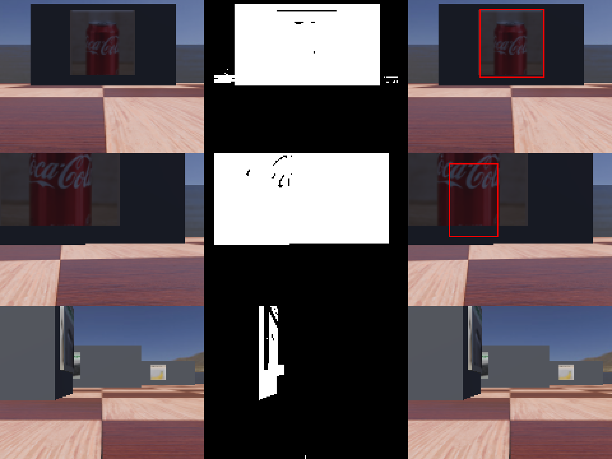

# find_poster_region() Evaluation

Recorded per [Issue #7](.github/issues/07-isolate-poster-region.md).

## Method

`find_poster_region()` (in `controllers/group_project_controller/vision_utils.py`) follows
the Week 1 pipeline -- HSV threshold, contours, bounding boxes -- keyed off the barrier body
rather than the poster panel directly (Issue #6 already found the poster's own brightness
varies too much by target to threshold reliably; see the module's own docstring for the
tested-and-rejected alternatives). The poster region is then the barrier's known geometric
fraction (0.22/0.50 width, 0.22/0.28 height -- `protos/TexturedBarrier.proto`).

Every design choice was tested against real frames, not reasoned about in the abstract --
including guards added only after real false positives were found on frames with no poster
at all (an absolute darkness ceiling, a solidity check, a check that the candidate actually
contains printed content) and, after review, a search over overlapping left/right
sub-windows in addition to the full frame (an unrelated dark object elsewhere in frame can
sit close enough to the real target that no single threshold separates them within the full
zone, but the half that excludes the other object isolates the real barrier cleanly). Full
debugging history in `docs/find_poster_region_notes.md`.

## Detection rate

| Set | Hit | Total | Rate |
|---|---:|---:|---:|
| Unclipped (required, >=90%) | 36 | 36 | 100.0% |
| Clipped (not required) | 52 | 67 | 77.6% |

## IoU against hand-labelled ground truth

20 required unclipped frames, labelled independently from the detector using raw-image
inspection, the `cv2.selectROI` helper, and the spot-checked Issue #5 capture measurements --
`docs/data/poster_region_labels.json`. Extra clipped stress cases are kept in a separate
file and reported separately below so the required labelled set is unambiguous.

| Set | n | Mean IoU | >= 0.5 |
|---|---:|---:|---:|
| Required unclipped labelled set | 20 | 0.787 | 20/20 |

| Frame | GT | Predicted | IoU |
|---|---|---|---:|
| `S1_d1p000_op00.png` | (57, 18, 41, 41) | (57, 19, 41, 41) | 0.95 |
| `S1_d0p800_op00.png` | (54, 6, 52, 52) | (54, 7, 51, 52) | 0.94 |
| `S3_d0p800_op00.png` | (51, 6, 52, 52) | (51, 7, 51, 52) | 0.94 |
| `C_S1_d0p800_hp00.png` | (55, 8, 52, 51) | (56, 7, 50, 53) | 0.93 |
| `C_S3_d0p800_hp00.png` | (51, 6, 52, 53) | (52, 7, 50, 53) | 0.93 |
| `S3_d1p300_op00.png` | (61, 27, 31, 32) | (61, 29, 31, 31) | 0.91 |
| `A_S8_d0p800_hp00.png` | (54, 6, 54, 53) | (56, 7, 50, 53) | 0.89 |
| `C_S3_d1p000_hm10.png` | (29, 17, 43, 43) | (33, 17, 39, 42) | 0.89 |
| `A_S8_d1p000_hp10.png` | (91, 18, 43, 41) | (90, 17, 38, 43) | 0.81 |
| `C_S1_d1p000_hp10.png` | (91, 20, 41, 38) | (90, 18, 38, 42) | 0.80 |
| `C_S3_d1p000_hp10.png` | (94, 18, 41, 41) | (92, 17, 37, 42) | 0.80 |
| `A_S2_d1p000_hm10.png` | (25, 17, 42, 42) | (32, 17, 38, 42) | 0.78 |
| `A_S2_d0p800_hp00.png` | (51, 8, 52, 52) | (44, 8, 55, 55) | 0.77 |
| `B_S6_d0p800_hp10.png` | (86, 7, 54, 51) | (90, 7, 38, 53) | 0.68 |
| `A_S2_d0p800_hp10.png` | (82, 8, 54, 50) | (90, 7, 38, 52) | 0.68 |
| `B_S6_d0p800_hm10.png` | (21, 6, 53, 52) | (32, 7, 38, 53) | 0.68 |
| `A_S8_d0p800_hp10.png` | (87, 8, 54, 50) | (83, 7, 42, 52) | 0.64 |
| `S3_d1p000_op00.png` | (61, 18, 43, 42) | (69, 19, 51, 41) | 0.58 |
| `A_S8_d1p000_hp00.png` | (60, 18, 42, 41) | (67, 19, 52, 41) | 0.57 |
| `B_S6_d1p000_hp00.png` | (59, 18, 41, 40) | (49, 14, 63, 46) | 0.57 |

**All 20/20 required unclipped frames clear IoU >= 0.5** -- see `docs/find_poster_region_notes.md` section 4 for how the frames that originally failed (all landing on the same degenerate fallback box) were fixed.

## Additional Clipped Stress Cases

These 5 hand-labelled clipped frames are kept outside the required IoU set because Issue #7's
detection-rate criterion is explicitly scoped to visible, unclipped posters. They are useful
diagnostics, but not the acceptance set.

| Set | n | Mean IoU | >= 0.5 |
|---|---:|---:|---:|
| Clipped stress cases | 5 | 0.144 | 0/5 |

| Frame | GT | Predicted | IoU |
|---|---|---|---:|
| `C_S1_d0p450_hm10.png` | (0, 1, 95, 56) | (32, 8, 38, 57) | 0.33 |
| `A_S8_d0p295_hp00.png` | (2, 0, 145, 56) | (32, 9, 38, 61) | 0.21 |
| `B_S6_d0p295_hp10.png` | (45, 0, 115, 55) | (32, 9, 38, 61) | 0.15 |
| `B_S6_d0p450_hm10.png` | (0, 0, 94, 56) | (90, 7, 38, 56) | 0.03 |
| `B_S4_d0p420_hp00.png` | (27, 0, 103, 57) | None | 0.00 |

## No-poster negative frames

18 real frames from a full rotation sweep (no route planning -- just rotate in place through
20 deg steps from a start pose and photograph each heading; see the temporary capture block
in `group_project_controller.py`'s `main()`, removed after this data was gathered).
**15/18 correctly returned `None`** (required: >=10).
Of the 3 that did return a box, `rot05_100deg.png` and
`rot06_120deg.png` genuinely have a station's poster visible at a distance/oblique angle
during the sweep (true positives, not misses) and `rot14_280deg.png` is a confirmed false
positive on an empty sky/water gradient -- a known, accepted trade-off (see
`docs/find_poster_region_notes.md` section 4): fixing it required a stricter solidity
cutoff that cost a real unclipped detection and an IoU pass, on a criterion that already
has large headroom (>=10 required,
15+ available either way).

| Frame | Predicted |
|---|---|
| `rot00_000deg.png` | None |
| `rot01_020deg.png` | None |
| `rot02_040deg.png` | None |
| `rot03_060deg.png` | None |
| `rot04_080deg.png` | None |
| `rot05_100deg.png` | (63, 21, 19, 39) |
| `rot06_120deg.png` | (126, 19, 16, 40) |
| `rot07_140deg.png` | None |
| `rot08_160deg.png` | None |
| `rot09_180deg.png` | None |
| `rot10_200deg.png` | None |
| `rot11_220deg.png` | None |
| `rot12_240deg.png` | None |
| `rot13_260deg.png` | None |
| `rot14_280deg.png` | (90, 37, 38, 23) |
| `rot15_300deg.png` | None |
| `rot16_320deg.png` | None |
| `rot17_340deg.png` | None |

## Figure strip

Raw frame / detection mask / chosen box, for a spread of cases (near-perfect match, a
clipped frame, and a no-poster negative):

## Compliance

Uses only HSV thresholding, contours and bounding boxes on the camera frame plus the exact
geometry in `protos/TexturedBarrier.proto` (a supplied project resource). No Webots Camera
Recognition node, no simulator ground-truth object identity, no reading of `.wbt` files or
texture filenames.
