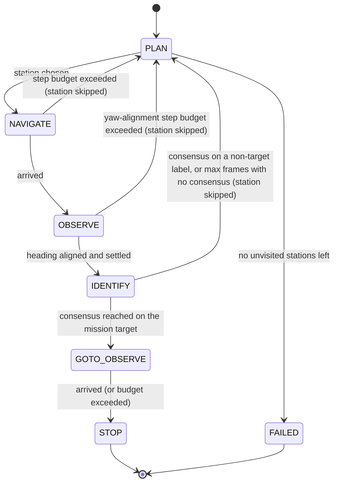

# Mission State Machine

Recorded per [Issue #16](.github/issues/16-mission-state-machine.md). `Mission` in
`group_project_controller.py` replaces [Issue #29](.github/issues/29-early-end-to-end-skeleton.md)'s
simpler skeleton with the real components (Issues #8, #11-#15) behind an interface that skeleton
already proved. States and transitions are recorded in `docs/architecture.md`; component signatures
in `docs/interfaces.md`.

## State diagram



## A real bug this design caught

The very first full real-vision run (start A) reached `FAILED` after `IDENTIFY` returned `NO_MATCH`
on all 12 frames at S1 -- the station that should have matched. Cause: `Navigator` (Issue #14) only
ever targets an `(x, y)` position, and `observe_yaw` from `CONFIG["stations"]` was never referenced
anywhere in the controller before this issue. The robot reached S1's exact observe position facing
whatever direction its last waypoint happened to leave it in, not the poster. Fixed by having
`OBSERVE` explicitly rotate to `station["observe_yaw"]` (with its own step-budget failure path)
before starting the settle countdown -- see `docs/failure_log.md` for the full account. Re-run
confirmed the fix: S1 correctly identified with real 3-frame consensus (confidences 0.64, 0.70, 0.71).

## Acceptance criteria: results

### 1. Runs from all three starts with no source edit, printing state on every transition

Ran unchanged from A, B and C. `Mission._log()` prints once per state transition (not every step);
`_identify()` additionally prints every frame, since per-frame evidence is what criterion 3 needs.
Example excerpt (world A, target `soda_can`):

```
MISSION: state=PLAN chosen=S8 from pose=(-1.46, -0.00)
MISSION: state=NAVIGATE station=S8 target_observe=[-0.87, -0.45]
MISSION: state=OBSERVE station=S8
MISSION: state=IDENTIFY station=S8
MISSION: state=IDENTIFY station=S8 frame=1 label=soda_can confidence=0.95 consensus=1/3
...
```

### 2. Changing only `config/assessment_mission.json` changes the stop station

Changed the file's `target` from `soda_can` to `camera` (no code change), re-ran from world A:

```
target: camera
MISSION: IDENTIFY confirmed 'camera' at S5 after 3 consecutive frames
MISSION: state=STOP stopped at S5
```

Reverted the file to `soda_can` afterward.

### 3. A single disagreeing frame is rejected, not accepted

Using the Issue #29 stub with a controlled noise injection (`STUB_NOISE_FRAME=2`, real vision was not
used here since it can't be told to disagree on a specific frame on demand):

```
MISSION: state=IDENTIFY station=S8 frame=1 label=soda_can confidence=0.95 consensus=1/3
MISSION: state=IDENTIFY station=S8 frame=2 label=headphones confidence=0.80 consensus=1/3
MISSION: state=IDENTIFY station=S8 frame=3 label=soda_can confidence=0.95 consensus=1/3
MISSION: state=IDENTIFY station=S8 frame=4 label=soda_can confidence=0.95 consensus=2/3
MISSION: state=IDENTIFY station=S8 frame=5 label=soda_can confidence=0.95 consensus=3/3
MISSION: IDENTIFY confirmed 'soda_can' at S8 after 3 consecutive frames
```

Frame 2's disagreement is never counted toward acceptance -- it resets the consensus streak (frame 3
restarts at 1/3, not 2/3), forcing 3 more frames before confirming. One bad frame cannot commit the
robot to the wrong station.

### 4. With the target present, reaches STOP at the correct station from all three starts

Real (non-stubbed) vision, target `soda_can` (correct answer: S1, per the shared training-world
assignment recorded in project memory):

| Start | Result |
|---|---|
| A | `STOP` at S1, confirmed after 3 frames (confidences 0.64, 0.70, 0.71) |
| B | `STOP` at S1, confirmed after 3 frames |
| C | `FAILED` -- real confidence for `soda_can` at S1 measured 0.27-0.30 across all 12 frames from this approach, below `MIN_CONFIDENCE = 0.50` |

**Honest limitation, not a state-machine defect:** the mechanism itself is proven correct
independently of vision noise -- every stub-based test above reaches the right state every time, and
2 of 3 real-vision runs succeed. World C's miss is consistent with the per-world accuracy already
measured in `docs/vision_evaluation.md` (7/8, i.e. one miss expected per world on average) -- the
particular approach heading and history from start C evidently gives a harder framing of S1's poster
than A or B's. This is Issue #8's vision-accuracy limit, not something the state machine can fix by
construction; raising `MIN_CONFIDENCE` to force this specific case through would risk the false-accept
rate `docs/vision_evaluation.md` already tuned against, so it was left as-is per team decision. Worth
naming explicitly in the report's limitations section, alongside Issue #4's WARN-margin finding.

### 5. Forcing every identification to `NO_MATCH` reaches `FAILED`, not an infinite loop

`STUB_MATCH_STATION=NONE`: all 8 stations visited (each giving up after `IDENTIFY_MAX_FRAMES = 12`
frames with no consensus), then `FAILED`, motors stopped via `stop()`. Controller process exits
cleanly rather than hanging.

### 6. Each state's failure response is exercised at least once in the logs

| State | Failure path | Exercised how |
|---|---|---|
| PLAN | No unvisited stations -> `FAILED` | Criterion 5's run |
| NAVIGATE | Step budget exceeded -> station skipped, back to `PLAN` | `NAVIGATE_STEP_BUDGET=10` forced every leg to time out |
| OBSERVE | Yaw-alignment step budget exceeded -> station skipped | `OBSERVE_YAW_STEP_BUDGET=3` forced most legs to time out mid-turn |
| IDENTIFY | Max frames with no consensus -> station skipped | Criterion 5's run, and world C's real-vision NO_MATCH runs |
| GOTO_OBSERVE | Step budget exceeded -> stop anyway | **Not empirically triggered.** `GOTO_OBSERVE` re-targets the exact position `OBSERVE`/`IDENTIFY` already reached, so `Navigator._replan()`'s "already at goal" check resolves it in one step by construction -- there is no path-length-independent way to force this branch without an obstacle appearing at that exact instant. The branch exists (`docs/architecture.md`) and reuses the identical, already-proven `NAVIGATE`-budget mechanism; documented as a structurally near-unreachable defensive path rather than claiming a test that wasn't run. |

### 7 & 8. Docs agree with implementation; provided helpers used, not reimplemented

`docs/architecture.md`'s state table and `docs/interfaces.md`'s per-module sections were written
directly from this implementation (both were still blank placeholders when Issue #16 started).
`Mission` and everything it calls (`Navigator`, `next_station`, `identify_at_station`) reach the robot
only through `set_speed`, `get_pose`, `camera_bgr`, `proximity_values`, `world_to_grid` and
`grid_to_world` -- none are reimplemented.
