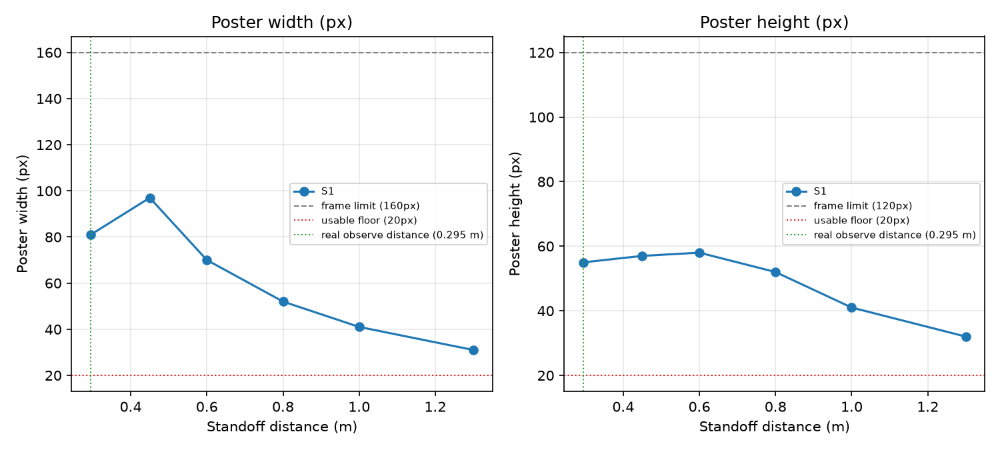

# Poster Visibility vs Standoff Distance

Recorded per [Issue #5](.github/issues/05-measure-poster-appearance-vs-standoff.md).

## Method

For each station, drove to the observe position, then stepped along the poster's own
facing axis to each standoff distance (plus a few +/-15 degree off-axis shots), stopped,
aimed at the poster centre, and captured `camera_bgr()`. Bounding box measured with a
two-stage heuristic (see `_measure_poster_bbox` in the capture block that produced this
data): first isolate the barrier body's own narrow, very consistent dark band (a
target-colour-agnostic signal -- it does not depend on which product image the poster
shows), then find the lighter poster patch within that footprint only. An earlier
single-stage, saturation-based version of this function mistook the floor's saturated
wood-grain texture for the poster and returned the whole frame on every capture; replaced
after inspecting the actual captured pixel values. Every measurement was spot-checked
against the `*_bbox.png` debug overlay saved alongside its frame.

**Note on the 0.30-0.60 m rows:** at these distances the poster (and sometimes even the
barrier) overflows the top of the 160x120 frame, so the measured width does not shrink
smoothly with distance the way it does from 0.80 m onward -- a partially cropped object's
visible width does not scale simply. This is expected, not a detector fault; it is exactly
why the recommended band below starts only once clipping stops.

Poster centre position (and so the standoff distances) was computed from
`CONFIG['stations'][i]['observe']` plus the ~0.295 m standoff figure, cross-checked
against the exact barrier translation/rotation in the world file and the poster's local
offset in `protos/TexturedBarrier.proto` -- matched to well under 1 mm, so the figure is
confirmed rather than assumed.

## Station S1

| Distance (m) | Offset (deg) | Width (px) | Height (px) | Clipped top | Clipped bottom | Frame |
|---:|---:|---:|---:|---|---|---|
| 0.295 | -15 | 83 | 55 | True | False | `docs/data/poster_captures/S1/S1_d0p295_om15.png` |
| 0.295 | +0 | 81 | 55 | True | False | `docs/data/poster_captures/S1/S1_d0p295_op00.png` |
| 0.295 | +15 | 70 | 56 | True | False | `docs/data/poster_captures/S1/S1_d0p295_op15.png` |
| 0.450 | +0 | 97 | 57 | True | False | `docs/data/poster_captures/S1/S1_d0p450_op00.png` |
| 0.600 | -15 | 67 | 58 | True | False | `docs/data/poster_captures/S1/S1_d0p600_om15.png` |
| 0.600 | +0 | 70 | 58 | True | False | `docs/data/poster_captures/S1/S1_d0p600_op00.png` |
| 0.600 | +15 | 66 | 58 | True | False | `docs/data/poster_captures/S1/S1_d0p600_op15.png` |
| 0.800 | +0 | 52 | 52 | False | False | `docs/data/poster_captures/S1/S1_d0p800_op00.png` |
| 1.000 | +0 | 41 | 41 | False | False | `docs/data/poster_captures/S1/S1_d1p000_op00.png` |
| 1.300 | +0 | 31 | 32 | False | False | `docs/data/poster_captures/S1/S1_d1p300_op00.png` |

**At the real observe distance (0.295 m):** does NOT fit fully in frame.
Backing frame: `docs/data/poster_captures/S1/S1_d0p295_op00.png`.

**Recommended identification standoff band for S1:** 0.800 m to 1.300 m.
(near bound = smallest tested distance with no top/bottom clipping; far bound = largest tested distance where the poster's shorter side is still >= 20 px.)

## Reading vs distance

