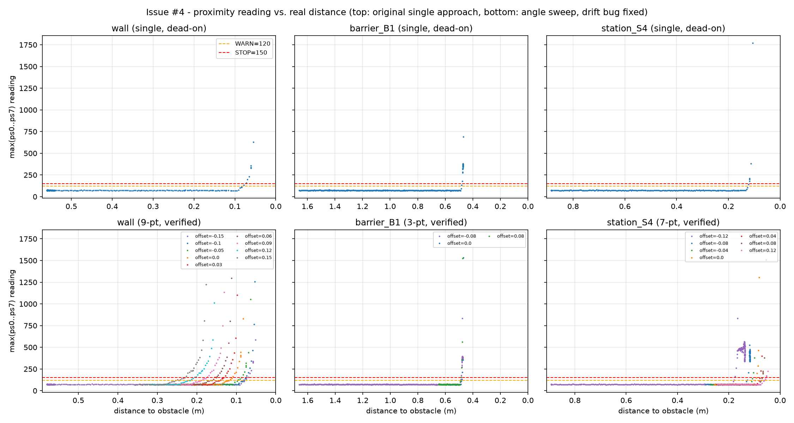

# Proximity Sensor Calibration

Recorded per [Issue #4](.github/issues/04-calibrate-proximity-thresholds.md). Sensors grouped as
Workshop 8 does: `ps0`, `ps1`, `ps2` right/front-right; `ps5`, `ps6`, `ps7` left/front-left;
`ps3`, `ps4` rear.

## Method

Drove the robot straight at one obstacle from each class, logging `distance_to()` (real distance
from `get_pose()`) and all 8 `proximity_values()` every timestep:

- **wall** — nearest arena wall to the start, from world A (`worlds/training_start_A.wbt`)
- **barrier_B1** — a B1-B5 navigation barrier, from world B
- **station_S4** — an observation-station barrier, from world C

Each ran as its own clean pass from the world's own start pose (not chained one after another —
an earlier attempt at chaining caused the robot to hit an unrelated obstacle partway to the next
target; see `docs/failure_log.md`). Raw logs: `docs/data/proximity_wall.csv`,
`docs/data/proximity_barrier_B1.csv`, `docs/data/proximity_station_S4.csv`.

**Follow-up (angle sweep):** each obstacle was then approached several more times at different
offsets from the original aim point, backing off between attempts, to check whether one angle per
obstacle was enough evidence. The first version of this sweep had a **methodology bug** — it
offset the aim point relative to the robot's *current* position after each back-off rather than a
fixed reference, so small heading error accumulated attempt over attempt and later offsets drifted
0.03-0.14 m away from the actual obstacle. That produced a false "total blind spot" result that was
briefly (and wrongly) written up here and used to justify lowering `STOP`. It's corrected below —
see `docs/failure_log.md` for the bug itself. The verified data:

- **wall**: 9 offsets, -0.15 to +0.15 m, aimed directly along the wall's own fixed coordinate
  (`wall_offset_target()` — immune to drift) — `docs/data/proximity_wall_finegrid.csv`
- **barrier B1**: 3 offsets, -0.08/0.0/+0.08 m — confirmed not drift-affected (target coordinates
  matched the intended geometry exactly) — `docs/data/proximity_barrier_B1_angles.csv`
- **station S4**: 7 offsets, -0.12 to +0.12 m, using a direction computed once from the true start
  and reused for every attempt (`fixed_direction()`) — `docs/data/proximity_station_S4_finegrid.csv`

Figure (top row: original single approach; bottom row: verified angle sweep): `docs/data/proximity_calibration.png`.

## What the data shows



All three obstacle classes look the same shape: the reading sits flat in a ~65-95 noise band with
no obstacle nearby, then rises sharply only in the last few centimetres before contact. Peak
reading at contact differed a lot by obstacle and approach angle:

| Obstacle | Distance where reading leaves the noise band | Reading at/near contact | Notes |
|---|---|---|---|
| wall | ~0.087 m | 1764 (`ps0`) | contact at 0.049 m |
| station S4 | ~0.126 m | 1769 (`ps1`) | contact at 0.107 m |
| barrier B1 | ~0.484 m | 355 (steady), 690 (momentary peak) | contact/rest at 0.471 m |

Barrier B1's low, steady reading (355) versus the wall/station's sharp spikes (>1750) is a real,
repeatable difference (confirmed on a second run), not noise: the approach path was a straight
line dead-centre onto B1's corner, so it hit both `ps0` and `ps7` at a similar oblique angle —
neither sensor ever pointed straight at a flat face, so neither spiked the way a single sensor did
in the wall/station tests when the approach was slightly off-centre. **Lesson: the reading a robot
gets at contact depends heavily on the angle it hits at, not just how close it is** — a threshold
tuned only on a favourable, near-perpendicular hit can under-read badly on a corner-on hit.

## The 0.06 m margin target isn't reachable from reading alone

Issue #4 asks for a `WARN` threshold that fires at least 0.06 m before contact. Measured against
that: the reading only leaves the noise floor 0.02-0.04 m before contact in every class tested
(wall: 0.087 - 0.049 = 0.038 m; station: 0.126 - 0.107 = 0.019 m; barrier B1: 0.484 - 0.471 = 0.013 m).
There is no reading threshold that can fire earlier than that, because the sensor simply isn't
giving a distinguishable-from-noise signal any further out — this is a property of the simulated
IR sensor's effective range against these surfaces, not a tuning problem. **The achievable margin
from `ps0`-`ps7` alone is roughly 1-4 cm, not 6 cm, at these approach speeds.**

This matters for [Issue #14](.github/issues/14-reactive-avoidance-with-recovery.md) (the avoidance
manoeuvre): reactive IR thresholding alone cannot guarantee a 6 cm buffer, especially for a
corner-on hit like B1's. Avoidance will need to also lean on the known occupancy grid (planning
clearance from the map, not just reacting to sensors) rather than relying on `WARN` to always give
early notice.

## Follow-up: what the verified angle sweep actually shows

**Wall** (bottom-left panel): all 9 offsets, -0.15 to +0.15 m, produced a strong rise — every one
climbs past 1000 before contact. **No blind spot anywhere on the wall.** The earlier report of a
near-zero reading at +0.08-0.15 m offset was the drift bug: those aim points had missed the wall
by up to 0.14 m, so there was genuinely nothing there to detect. With the bug fixed, the wall is
consistently the *easiest* obstacle to detect, not the hardest.

**Barrier B1** (bottom-middle panel, unaffected by the bug): all 3 offsets show the same pattern —
a brief transient spike on first contact (355-1538, no relationship to offset), then, once wedged
against the surface, the reading settles to a **repeatable ~350-380**. This remains the cleanest
evidence of a genuinely weaker-but-still-solid contact signal.

**Station S4** (bottom-right panel, re-verified with the fixed method): offsets -0.12 and -0.08 m
produced the same "grazing" behaviour B1 showed — the robot slides along the barrier's surface at
a shallow angle instead of stopping dead-on, settling at a steady **~350-355**, well above `STOP`.
Offset +0.12 m is the one genuinely weak case in the *verified* data: it climbed to **226** right
at the point of contact (0.047 m), crossing `STOP = 150` at roughly 0.054 m — about 0.007 m of
margin, plus whatever additional buffer the robot's own body radius (~0.037 m) adds beyond the
0.05 m distance cutoff used to end each test.

**This matters:** the true worst case in the trustworthy data is station S4's 226 (or B1's steady
355, whichever direction a real approach happens to hit), not the wall's phantom 207. `STOP = 150`
— chosen before this correction, from the (invalid) wall reading — turns out to still be the right
value once checked against the *real* worst case, with a thinner but real margin.

## True noise floor

Checking every logged reading further than 0.3 m from any obstacle (0.9 m for the B1 tests, since
their contact zone starts further out): the reading never exceeds **80.2** anywhere, in any log,
with a mean around 72.

## Chosen thresholds

```python
WARN = 120   # named constants in group_project_controller.py
STOP = 150
```

- **`WARN = 120`**: comfortably above the true noise ceiling (80.2, ~1.5x headroom), so it won't
  false-trigger, but low enough to catch the rise as soon as it's distinguishable from noise.
- **`STOP = 150`**: strictly greater than `WARN`, and sits below the weakest *verified* near-contact
  reading (station S4's off-centre 226) with real margin (~0.007 m before that test's contact
  point), and well below B1's steady ~350-380. Comfortably above the 80.2 noise ceiling.

This whole episode — a real result, an invalidated result from a buggy sweep, then re-verification
— is worth keeping in the report as-is rather than cleaning up: it's a concrete demonstration of why
a threshold needs to be checked against evidence you've actually confirmed is measuring what you
think it's measuring, not just evidence that looks alarming.

Decision recorded with criteria and evidence in `docs/decision_log.md`.
