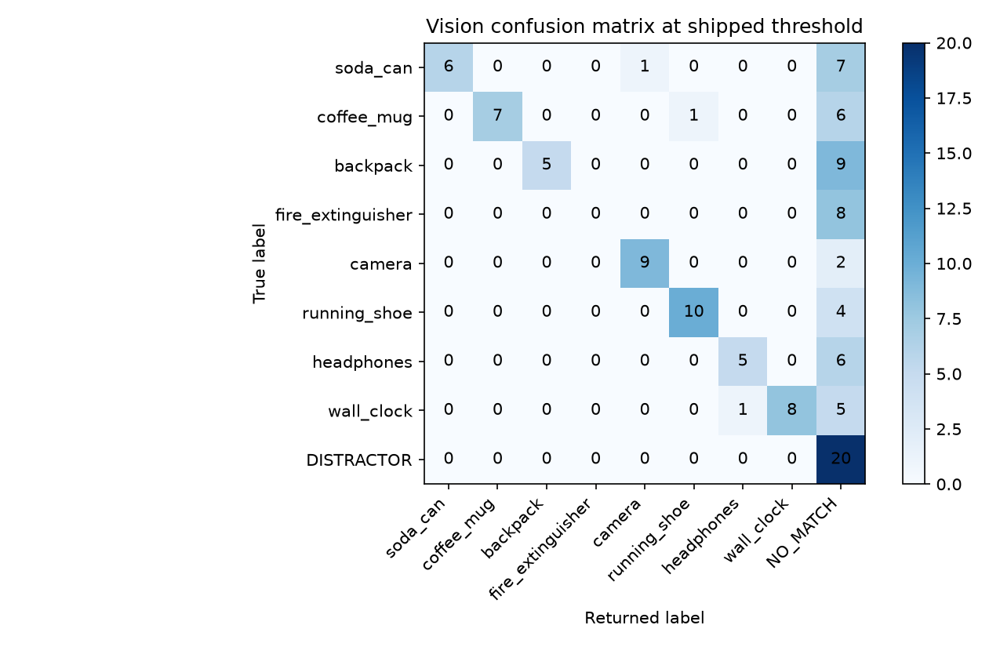
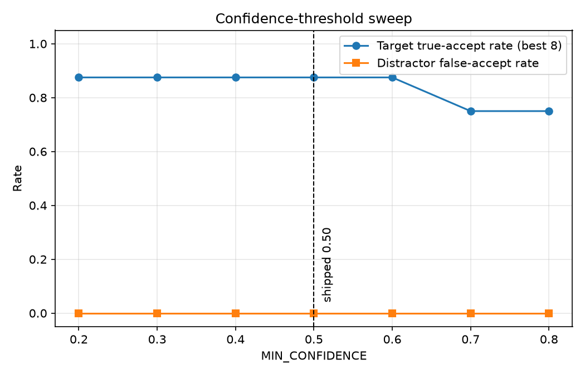

# Vision Accuracy and Distractor Rejection

Recorded per [Issue #9](../.github/issues/09-evaluate-accuracy-distractor-rejection.md).

## Method

The evaluator runs the real `find_poster_region()` and `identify()` pipeline on the saved
station captures, then scores all 20 images in `textures/distractors/` as negative crops.
A correct distractor result is always `NO_MATCH`.

Shipped thresholds: `MIN_CONFIDENCE = 0.50`,
`MIN_CONFIDENCE_MARGIN = 0.20`. Issue #9 also adds a
same-reference sanity check for high-confidence open-set distractors: after the ResNet
head predicts a class, the crop must still look enough like that class's supplied
`target_<label>.png` reference image.

## Acceptance Evidence

- Valid outputs across station and distractor rows: 120/120.
- Distractor false-accepts at the shipped threshold: 0/20.
- Combined best captured station crop accuracy: 7/8.
- `NO_MATCH` rate over all evaluated rows: 0.558.
- Threshold sweep values tested: 0.20, 0.30, 0.40, 0.50, 0.60, 0.70, 0.80.

## Per-World Station Coverage

All eight stations are captured in each of the three training worlds, so the per-world
accuracy below uses only that world's own frames rather than borrowing a best crop from
another world.

| World | Captured stations | Best-crop correct | Missing stations |
|---|---|---:|---|
| A | `S1`, `S2`, `S3`, `S4`, `S5`, `S6`, `S7`, `S8` | 7/8 |  |
| B | `S1`, `S2`, `S3`, `S4`, `S5`, `S6`, `S7`, `S8` | 7/8 |  |
| C | `S1`, `S2`, `S3`, `S4`, `S5`, `S6`, `S7`, `S8` | 7/8 |  |

## Best Crop Per Station

| Station | Truth | Returned | Confidence | Margin | Reference similarity | Frame |
|---|---|---|---:|---:|---:|---|
| `S1` | `soda_can` | `soda_can` | 0.843 | 0.800 | 0.719 | `C_S1_d0p800_hp00.png` |
| `S2` | `coffee_mug` | `coffee_mug` | 0.958 | 0.943 | 0.319 | `A_S2_d0p800_hp10.png` |
| `S3` | `backpack` | `backpack` | 0.621 | 0.463 | 0.216 | `B_S3_d0p800_hm10_issue9.png` |
| `S4` | `fire_extinguisher` | `NO_MATCH` | 0.931 | 0.917 | 0.070 | `B_S4_d0p295_hp00.png` |
| `S5` | `camera` | `camera` | 0.987 | 0.983 | 0.006 | `B_S5_d0p450_hm10.png` |
| `S6` | `running_shoe` | `running_shoe` | 0.988 | 0.985 | 0.652 | `B_S6_d0p800_hm10.png` |
| `S7` | `headphones` | `headphones` | 0.910 | 0.873 | -0.026 | `C_S7_d0p295_hp00_issue9.png` |
| `S8` | `wall_clock` | `wall_clock` | 0.994 | 0.991 | 0.592 | `A_S8_d1p000_hp00.png` |

## Confusion Matrix

CSV: `docs/data/vision_confusion_matrix.csv`

## Threshold Sweep

At the shipped point (0.50), the best-station true-accept rate is
0.875 and the distractor false-accept
rate is 0.000.

## Precision And Recall

| Label | TP | FP | FN | Precision | Recall |
|---|---:|---:|---:|---:|---:|
| `soda_can` | 6 | 0 | 8 | 1.000 | 0.429 |
| `coffee_mug` | 7 | 0 | 7 | 1.000 | 0.500 |
| `backpack` | 5 | 0 | 9 | 1.000 | 0.357 |
| `fire_extinguisher` | 0 | 0 | 8 | - | 0.000 |
| `camera` | 9 | 1 | 2 | 0.900 | 0.818 |
| `running_shoe` | 10 | 1 | 4 | 0.909 | 0.714 |
| `headphones` | 5 | 1 | 6 | 0.833 | 0.455 |
| `wall_clock` | 8 | 0 | 6 | 1.000 | 0.571 |

## Distractor Rejection

All 20 distractor textures returned `NO_MATCH`; full table: `docs/data/vision_distractor_rejection.csv`.

| Distractor | Raw class | Confidence | Reference similarity | Final result | Reason |
|---|---|---:|---:|---|---|
| `banana_a.png` | `backpack` | 0.348 | 0.061 | `NO_MATCH` | `below_min_confidence` |
| `banana_b.png` | `coffee_mug` | 0.448 | 0.037 | `NO_MATCH` | `below_min_confidence` |
| `books_a.png` | `fire_extinguisher` | 0.853 | 0.167 | `NO_MATCH` | `below_reference_similarity` |
| `books_b.png` | `fire_extinguisher` | 0.424 | 0.172 | `NO_MATCH` | `below_min_confidence` |
| `chair_a.png` | `coffee_mug` | 0.413 | 0.041 | `NO_MATCH` | `below_min_confidence` |
| `chair_b.png` | `coffee_mug` | 0.442 | 0.050 | `NO_MATCH` | `below_min_confidence` |
| `keyboard_a.png` | `coffee_mug` | 0.366 | 0.079 | `NO_MATCH` | `below_min_confidence` |
| `keyboard_b.png` | `coffee_mug` | 0.543 | 0.092 | `NO_MATCH` | `below_reference_similarity` |
| `landscape_a.png` | `headphones` | 0.208 | 0.196 | `NO_MATCH` | `below_min_confidence` |
| `monitor_a.png` | `backpack` | 0.260 | 0.279 | `NO_MATCH` | `below_min_confidence` |
| `monitor_b.png` | `backpack` | 0.224 | 0.398 | `NO_MATCH` | `below_min_confidence` |
| `plant_a.png` | `headphones` | 0.232 | 0.174 | `NO_MATCH` | `below_min_confidence` |
| `plant_b.png` | `camera` | 0.318 | 0.301 | `NO_MATCH` | `below_min_confidence` |
| `soccer_ball_a.png` | `coffee_mug` | 0.749 | 0.058 | `NO_MATCH` | `below_reference_similarity` |
| `soccer_ball_b.png` | `wall_clock` | 0.555 | -0.018 | `NO_MATCH` | `below_reference_similarity` |
| `teddy_bear_a.png` | `wall_clock` | 0.454 | -0.014 | `NO_MATCH` | `below_min_confidence` |
| `teddy_bear_b.png` | `wall_clock` | 0.483 | -0.008 | `NO_MATCH` | `below_min_confidence` |
| `toaster_a.png` | `headphones` | 0.439 | 0.192 | `NO_MATCH` | `below_min_confidence` |
| `toaster_b.png` | `coffee_mug` | 0.315 | 0.108 | `NO_MATCH` | `below_min_confidence` |
| `umbrella_b.png` | `coffee_mug` | 0.480 | 0.170 | `NO_MATCH` | `below_min_confidence` |

## Known Failure Condition

`B_S4_d0p295_hp00.png` is the clearest remaining miss: it is station
`S4` / `fire_extinguisher`, but the best crop still returns
`NO_MATCH` with confidence 0.931. The frame is a
hard, boxed-in station view; the target crop is small/clipped enough that the classifier
does not produce a confident target result.

## Output Files

- `docs/data/vision_confusion_matrix.csv` and `docs/data/vision_confusion_matrix.png`
- `docs/data/vision_precision_recall.csv`
- `docs/data/vision_distractor_rejection.csv`
- `docs/data/vision_target_predictions.csv`
- `docs/data/vision_threshold_sweep.csv` and `docs/data/vision_threshold_sweep.png`
- `docs/data/vision_evaluation_results.json`
